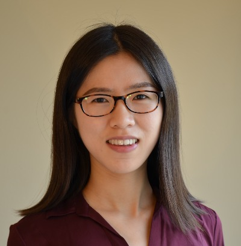
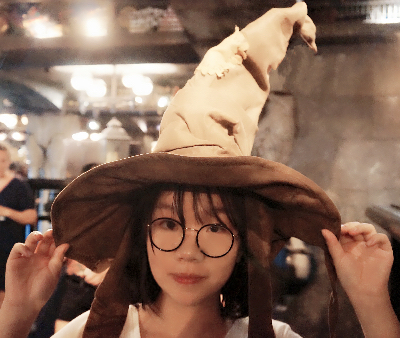
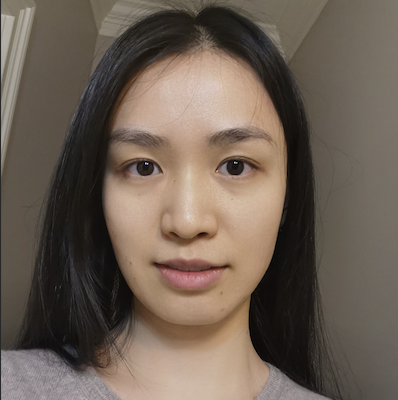
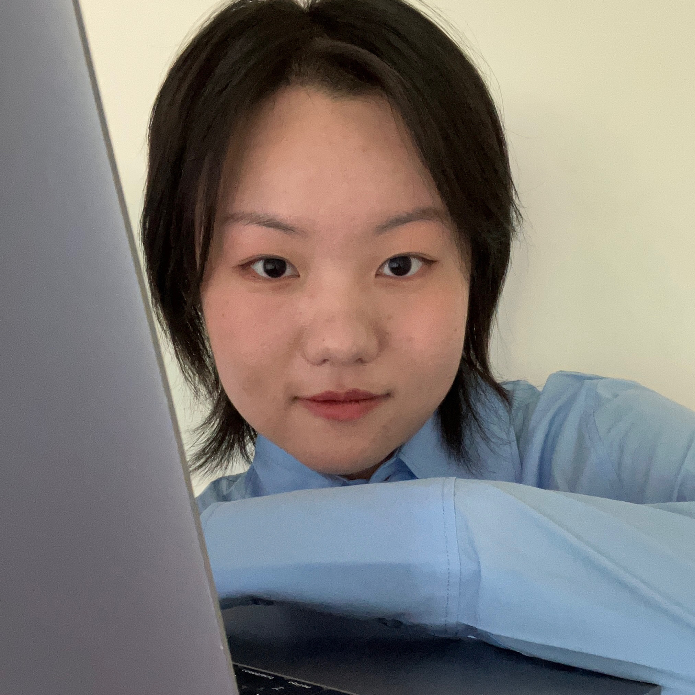
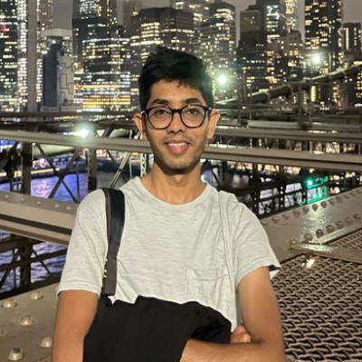
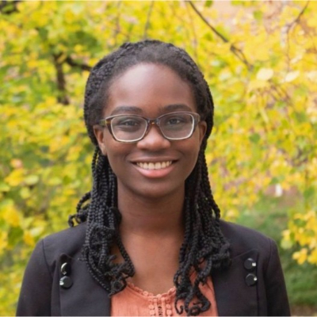
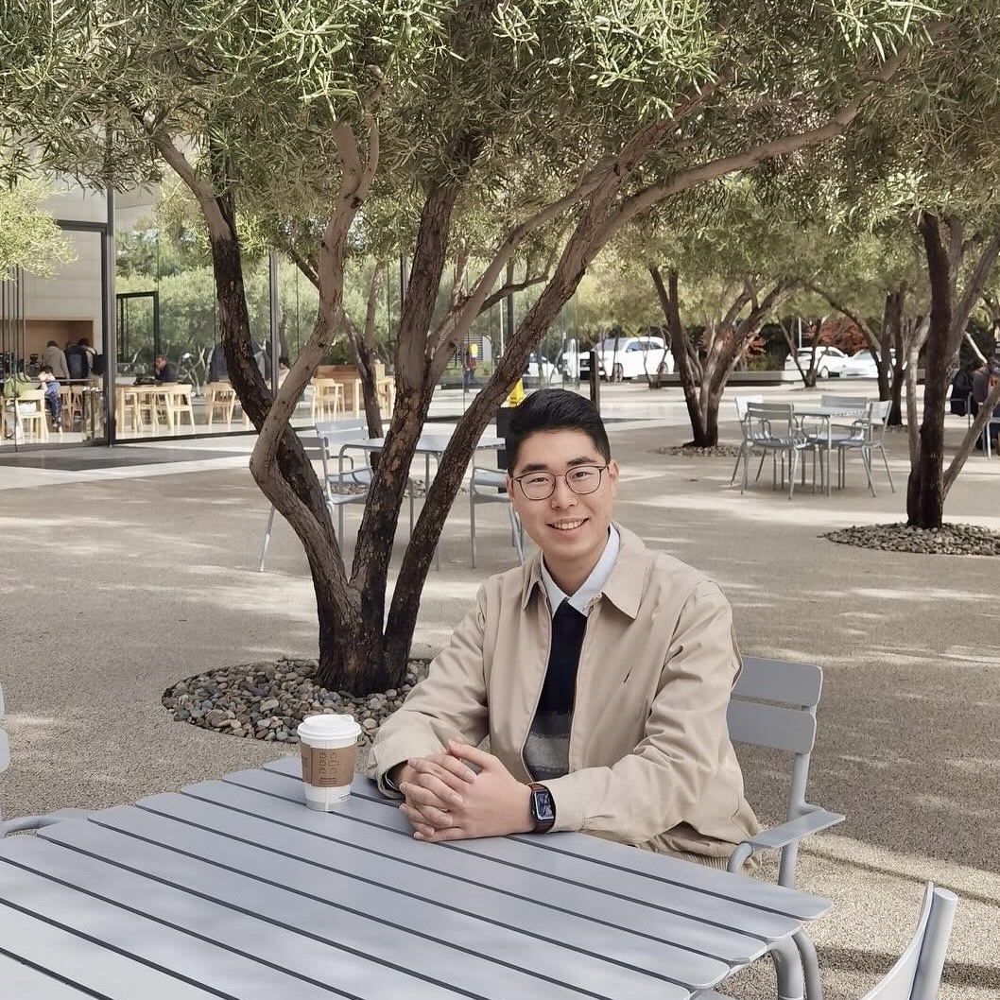
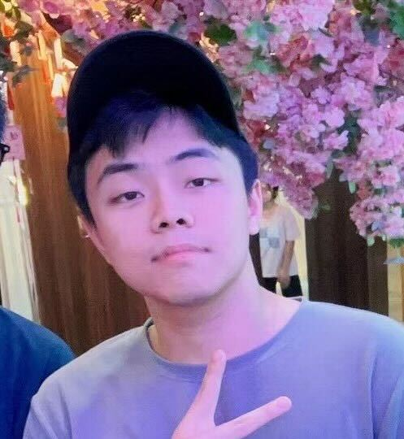

The Human-Autonomy Teaming (HAT) Lab aims to improve human performance, safety, and well-being in intelligent systems, with applications ranging from transportation, healthcare, to military domains. By applying both data-driven and theory-driven methods, the work (1) analyzes how humans interact with technologies; (2) develops computational models to simulate and predict human behaviors; and (3) proposes and evaluates design ideas to enable effective and safe collaborations between humans and intelligent agents. See more information on [Research](./research).

<a role="button" href="#bm1" class="btn btn-primary btn-md"> Lab Director </a>
<a role="button" href="#bm2" class="btn btn-primary btn-md"> Current Students </a>
<a role="button" href="#bm3" class="btn btn-primary btn-md"> Lab Alumni</a>

---
## Lab Director {#bm1}

{::nomarkdown}

    

        
Na Du is an Assistant Professor in the Department of Informatics and Networked Systems, School of Computing and Information, at the University of Pittsburgh. She received her Ph.D. in Industrial & Operations Engineering from University of Michigan, with a Graduate Certificate in Data Science at Michigan Institute for Data Science.

    

    

        
    

{:/}

&nbsp;

---
## Current Students {#bm2}

{::nomarkdown}

    

        
Lesong Jia is a PhD student in the Department of Informatics and Networked Systems, School of Computing and Information, at the University of Pittsburgh. He received his master's degree in Design and bachelor's degree in Mechanical Engineering, both from Southeast University. His research interests include Situation Awareness and Human-computer Interaction.

    

    

        
    

{:/}

&nbsp;

{::nomarkdown}

    

        
 Shihong Ling is a PhD student in the Department of Informatics and Networked System, School of Computing and Information, at the University of Pittsburgh. He earned his bachelor's degree in Computer Science from Case Western Reserve University and master’s degree in Intelligent Robotics from University of Southern California. His current interested research area is human-robot teaming.

    

    

        
    

{:/}

&nbsp;

{::nomarkdown}

    

        
Yutong Zhang is a PhD student in the Department of Informatics and Networked Systems, School of Computing and Information, at the University of Pittsburgh. She received a B.S. in Computer Science and Master degree in Information Science. Her research interests are human-centered interaction and human cognition and behavior study.

    

    

        
    

{:/}

&nbsp;

{::nomarkdown}

    

        
Yaohan Ding is a PhD student in the Intelligent Systems Program, School of Computing and Information, at the University of Pittsburgh. Previously, She received her B.S. in Biomedical Engineering from Sichuan University, China. Her current research interest is the trust between drivers and autonomous vehicles.

    

    

        
    

{:/}

&nbsp;

<!-- {::nomarkdown}

    

        
Beining Yang is a graduate student in Information Science at the University of Pittsburgh. She earned her B.S. in Information Science at Cornell University. Her research focuses on Human Computer Interaction, Virtual Reality, and Data Analysis. One fun fact about her: the only pet she had ever kept is a hermit crab when she was eight.

    

    

        
    

{:/}

&nbsp;

{::nomarkdown}

    

        
Nihal Desai is a graduate student in the Dept. of Information Science, School of Computing and Information, at the University of Pittsburgh. He previously earned his Bachelors degree in Electronics and Instrumentation from BMS College of Engineering, India. His current research interest is human-centered interaction, accessible design and autonomous vehicles.

    

    

        
    

{:/}

&nbsp;

 -->

{::nomarkdown}

    

        
Chenglue Huang is a graduate student in the Department of Information Science in the School of Computing and Information at the University of Pittsburgh. Prior to pursuing his graduate studies, he obtained his Bachelor's degree in Computer Science from Xi'an University of Architecture and Technology. His current research interests lie in the fields of Human-Computer Interaction, Natural Language Processing, and Knowledge Graphs. In addition to his academic pursuits, he also enjoys the sport of fencing.

    

    

        
    

{:/}

&nbsp;

{::nomarkdown}

    

        
Danneil Mubbala is an undergraduate student in the Kenneth P. Dietrich School of Arts & Sciences at the University of Pittsburgh. She is pursuing a Psychology major with a minor in Business. Her research interests include human-computer interaction, decision science, and behavioral research. One fun fact about her: she loves musical theatre.

    

    

        
    

{:/}

&nbsp;

{::nomarkdown}

    

        
Bowen Ye is an undergraduate student in the School of Computing and Information at the University of Pittsburgh. He is pursuing an Information Science major and a minor in Computer Science. His research interests include Human-Computer Interaction, autonomous vehicles, and user experience design. He is a super enthusiast in cars and a huge F1 fan. Visiting Art galleries is also one of his great hobbies.

    

    

        
    

{:/}

&nbsp;

{::nomarkdown}

    

        
Yu Liu is a senior undergraduate student majoring in Computer Science in the department of Computer Science. My research interests are Computer Vision, Computer Graphic and Machine learning. And I love gaming and drawing.

    

    

        
    

{:/}

&nbsp;

---
## Lab Alumni {#bm3}

- Beining Yang (MS'24, IS): Privacy awareness in Virtual Reality. --> PhD student @ Nanyang Technological University
- Nihal Desai (MS'24, IS): Emotion regulation in human-robot interaction. --> Salesforce developer @ Watsco
- Shiqi Wu (MS'24, ECE): Developing driving simulation in Unreal Engine. --> MS student @ Chalmers University of Technology
- Anjnesh Sharma (MS'23, IS): Exploratory analysis of automated vehicle crashes using an NLP Pipeline. --> Engineer @ Qualcomm
- Vigneshwar Pesaru (MS'22, OR): Modeling driving behavior using naturalistic driving dataset. --> Solutions Architect (AI/ML) @ BlueYonder
- Yingfan Zhou (IS): Developing driving simulation in Unreal Engine. --> PhD student @ Penn State
- Minh Phan (CS & Art): Designing navigation tools for people with visual impairments. --> Undergraduate @ College of Wooster

