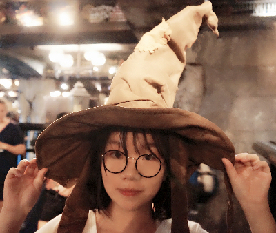
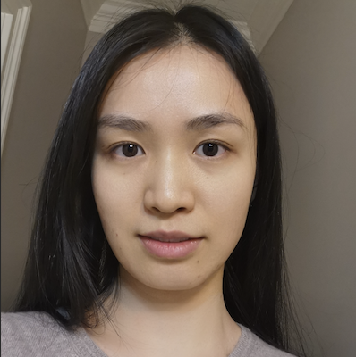
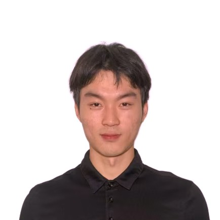

The Human-Autonomy Teaming (HAT) Lab aims to improve human performance, safety, and well-being in intelligent systems, with applications ranging from transportation, healthcare, to military domains. By applying both data-driven and theory-driven methods, the work (1) analyzes how humans interact with technologies; (2) develops computational models to simulate and predict human behaviors; and (3) proposes and evaluates design ideas to enable effective and safe collaborations between humans and intelligent agents. See more information on [Research](./research).

<a role="button" href="#bm1" class="btn btn-primary btn-md"> Lab Director </a>
<a role="button" href="#bm2" class="btn btn-primary btn-md"> Current Students </a>
<a role="button" href="#bm3" class="btn btn-primary btn-md"> Lab Alumni</a>

---
## Lab Director {#bm1}

{::nomarkdown}

    

        
Na Du is an Assistant Professor in the Department of Informatics and Networked Systems, School of Computing and Information, at the University of Pittsburgh. She received her Ph.D. in Industrial & Operations Engineering from University of Michigan, with a Graduate Certificate in Data Science at Michigan Institute for Data Science.

    

    

        
    

{:/}

&nbsp;

---
## Current Students {#bm2}

{::nomarkdown}

    

        
Lesong Jia is a PhD student in the Department of Informatics and Networked Systems, School of Computing and Information, at the University of Pittsburgh. He received his master's degree in Design and bachelor's degree in Mechanical Engineering, both from Southeast University. His research interests include Situation Awareness and Human-computer Interaction.

    

    

        
    

{:/}

&nbsp;

{::nomarkdown}

    

        
 Shihong Ling is a PhD student in the Department of Informatics and Networked System, School of Computing and Information, at the University of Pittsburgh. He earned his bachelor's degree in Computer Science from Case Western Reserve University and master’s degree in Intelligent Robotics from University of Southern California. His current interested research area is human-robot teaming.

    

    

        
    

{:/}

&nbsp;

{::nomarkdown}

    

        
Yutong Zhang is a PhD student in the Department of Informatics and Networked Systems, School of Computing and Information, at the University of Pittsburgh. She received a B.S. in Computer Science and Master degree in Information Science. Her research interests are human-centered interaction and human cognition and behavior study.

    

    

        
    

{:/}

&nbsp;

{::nomarkdown}

    

        
Yaohan Ding is a PhD student in the Intelligent Systems Program, School of Computing and Information, at the University of Pittsburgh. Previously, She received her B.S. in Biomedical Engineering from Sichuan University, China. Her current research interest is the trust between drivers and autonomous vehicles.

    

    

        
    

{:/}

&nbsp;

{::nomarkdown}

    

        
Werner Hager is a PhD student in the Intelligent Systems Program, School of Computing and Information, at the University of Pittsburgh. He received his bachelor’s degree in Computational Data Science from Pennsylvania State University. His current research interests are in human-agent teaming and imitation of human behavior.

    

    

        
    

{:/}

&nbsp;

{::nomarkdown}

    

        
Kevin Liu is an undergraduate student in the School of Computing and Information at the University of Pittsburgh, pursuing a major in Computer Science. His research interests include Human-Computer Interaction and behavioral-based robotics learning.

    

    

        
    

{:/}

&nbsp;

{::nomarkdown}

    

        
Ziyan Wang is a Research Technician at the University of Pittsburgh School of Medicine. He received his bachelor's degree in Psychology from the University of Pittsburgh. His research interests include user experience research, cognitive science, and biomedical research.

    

    

        
    

{:/}

&nbsp;

---
## Lab Alumni {#bm3}

- Danneil Mubbala (BS'26, Psychology): Human-machine cooperation strategies in mixed traffic --> Master student @ Carnegie Mellon University
- Bowen Ye (BS'26, IS): Human factors in intelligent transportation systems --> Master student @ University of Michigan
- Makayla Chang (IS): Understanding and modeling Multimodal Instruction Patterns in Human–Robot Interaction --> Undergraduate @ University of Michigan
- Yang Ye (CS): Insights from Diverse User Groups into Human–Robot Communication in Domestic Settings --> Undergraduate @ Pitt
- Sai Vivek Chava (MS'25, IS): Multi-human-multi-drone testbed development in Unity
- Yu Liu (BS'25, CS): Explainable AI and Human-robot interaction --> PhD student @ University of Maryland, Baltimore County (UMBC)
- Chenglue Huang (MS'24, IS): Situational awareness in human-agent teams --> PhD student @ New Jersey Institute of Technology
- Beining Yang (MS'24, IS): Privacy awareness in Virtual Reality --> PhD student @ Nanyang Technological University
- Nihal Desai (MS'24, IS): Emotion regulation in human-robot interaction --> Salesforce developer @ Watsco
- Shiqi Wu (MS'24, ECE): Developing driving simulation in Unreal Engine --> MS student @ Chalmers University of Technology
- Anjnesh Sharma (MS'23, IS): Exploratory analysis of automated vehicle crashes using an NLP Pipeline --> Engineer @ Qualcomm
- Vigneshwar Pesaru (MS'22, OR): Modeling driving behavior using naturalistic driving dataset --> Solutions Architect (AI/ML) @ BlueYonder
- Yingfan Zhou (IS): Developing driving simulation in Unreal Engine --> PhD student @ Penn State
- Minh Phan (CS & Art): Designing navigation tools for people with visual impairments --> Undergraduate @ College of Wooster

