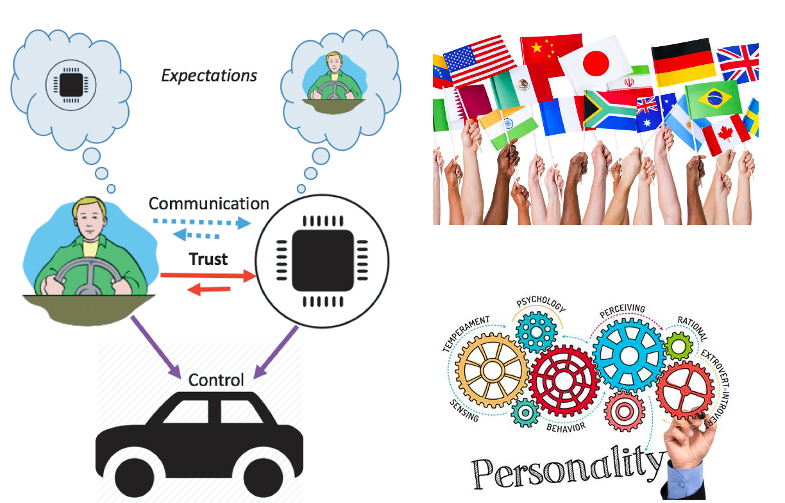

Our research goal is to improve human performance, safety, and well-being by applying human factors, data analytics, and cognitive psychology to the analysis, design, and evaluation of the intelligent systems. Research topics include: 

<a role="button" href="#bm1" class="btn btn-primary btn-md">Human Factors in Intelligent Transportation Systems </a>
<a role="button" href="#bm2" class="btn btn-primary btn-md">Human Behavior Modeling </a>
<a role="button" href="#bm3" class="btn btn-primary btn-md">Trust in Human-Automation Teaming</a>

&nbsp;

---
## Human Factors in Intelligent Transportation Systems {#bm1}

Intelligent transportation systems with connected and automated vehicles (CAVs) have the potential to provide our society with more fuel-efficient driving, reduce driving-related injuries and deaths, and reshape transportation and logistics. While CAVs are not completely ready on the road, it is necessary to study human factors in intelligent transportation systems to improve human performance, safety, and well-being. Our studies investigate drivers' behavioral and physiological responses in various driving environments. We also design and evaluate human-machine interfaces (HMIs) to improve user experience and driving safety in intelligent transportation systems. 
<!-- While we are a long way from the fully automated vehicles, automated driving features at SAE Level 3, such as the Honda Sensing Elite, are introduced into the market. With conditional or high automation, drivers will no longer be required to actively monitor the driving environment and can potentially engage in non-driving-related tasks. -->

{::nomarkdown}
		

			

				

<UL>
<li>Du et al. (2020). Physiological responses to takeover requests in conditionally automated driving. Accident & Analysis Prevention. <a href="http://doi.org/10.1016/j.aap.2020.105804">[PDF]</a> </li>
<li>Du et al. (2020). Examining the effects of emotional valence and arousal on takeover performance in conditionally automated driving. Transportation Research Part C: Emerging Technologies.  <a href="http://doi.org/10.1016/j.trc.2020.01.006">[PDF]</a> </li>
<li>Du et al. (2020). Evaluating Effects of Cognitive Load, Takeover Request Lead Time, and Traffic Density on Drivers' Takeover Performance in Conditionally Automated Driving. Automotive UI 2020.  <a href="http://doi.org/10.1145/3409120.3410666">[PDF]</a>  <a href="https://www.youtube.com/watch?v=F34DHjgcn2I">[Video]</a> </li>
<!-- <li>Du et al. (2020). Examining effects of scenario type and vehicle speed on takeover readiness and performance in conditionally automated driving. HFES 2020. <a href="https://doi.org/10.1177/1071181320641482">[PDF]</a>  <a href="https://www.youtube.com/watch?v=Ln4pPmwiI9M">[Video]</a> </li> -->
</UL>
				

			

  			

				
			

  

{:/}

&nbsp;

&nbsp;

<!-- {::nomarkdown}

{:/}
- Du et al. (2020). Physiological responses to takeover requests in conditionally automated driving. Accident & Analysis Prevention. 
- Du et al. (2020). Examining the effects of emotional valence and arousal on takeover performance in conditionally automated driving. Transportation Research Part C: Emerging Technologies. [PDF]
- Du et al. (2020). Evaluating Effects of Cognitive Load, Takeover Request Lead Time, and Traffic Density on Drivers' Takeover Performance in Conditionally Automated Driving. Automotive UI 2020. [PDF] [Video]
- Du et al. (2020). Examining effects of scenario type and vehicle speed on takeover readiness and performance in conditionally automated driving. HFES 2020. [Video]
 -->

---
## Human Behavior Modeling {#bm2}

We use both data-driven methods and cognitive architecture to model dynamic human behaviors and mental states in cyber-physical systems. By leveraging models and methods from both human factors and machine learning, we develop computational models that are capable of predicting or inferring human behaviors when they interact with technologies. The inputs of models can be text, video, physiological data, etc. For example, we develop computational models to predict driver takeover performance in conditionally automated driving and situational awareness in highly automated driving. We use large-scale naturalistic driving datasets and crash databases to model real-world driver bahaviors and improve driving safety. 

{::nomarkdown}
		

			

				

<UL>
<li>Ayoub, J.*, Du, N.*, Yang, X. J., & Zhou, F. (2022). Predicting driver takeover time in conditionally automated driving. IEEE Transactions on Intelligent Transportation Systems. (*Equal contribution). <a href="https://doi.org/10.1109/TITS.2022.3154329">[PDF]</a> </li>
<li>Du, N., Zhou, F., Pulver E., Tilbury, D. M., Robert, L. P., Pradhan, A. K., & Yang, X. J. (2020). Predicting driver takeover performance in  conditionally  automated  driving. Accident & Analysis Prevention. <a href="http://doi.org/10.1016/j.aap.2020.105748">[PDF]</a> </li>
<li>Du, N., Zhou, F., Pulver E., Tilbury, D. M., Robert, L. P., Pradhan, A. K., & Yang, X. J. (2020). Predicting Takeover Performance in Conditionally Automated Driving. CHI 2020. <a href="http://doi.org/10.1145/3334480.3382963">[PDF]</a> </li>
</UL>
				

			

  			

				
			

  

{:/}

&nbsp;

&nbsp;

---
## Trust in Human-Automation Teaming {#bm3}

The advances in artificial intelligence (AI) and machine learning empower a new generation of intelligent systems. However, human operators increasingly treat automation as a mysterious black box and lack appropriate trust in and dependence on the intelligent systems. To tackle this challenge, our studies design and evaluate interfaces with different information types, timing, and modality to increase system transparency. This work helps human operators develop appropriate trust in automation, increase technology acceptance, and collaborate with intelligent systems more effectively. The application domains include automated vehicles, automated decision aids (military operations and medical diagnosis), and general algorithms. 

<!-- When it comes to automated vehicles, there are serious concerns about whether individuals will choose to employ automated vehicles (AVs). One of the most central of these concerns is the lack of trust in AVs. In this project, we explored the possibility of using explanations of vehicle actions to help drivers build trust in automated vehicles. We conducted a human-subject experiment in a driving simulator and found that explanations provided before an AV acted were associated with higher trust in and preference for the AV. Furthermore, We investigated how drivers' personality and culture backgrounds influenced such interactions. Our results have important implications for the adoption of AVs.

Automated decision aids have been used in a wide array of domains such as military operations and medical diagnosis.  To facilitate appropriate trust in and dependence on automation, this study examined the effects of disclosing different types of likelihood information on human operators’ trust in automation and their team performance in the context of a simulated surveillance task. The results indicate that not all likelihood information is equal in aiding human-automation team performance. Directly presenting the hit and correct rejection rates of an automated decision aid should be avoided. Otherwises, baysian reasoning needs to be emphasized as countermeasures to eliminate its negative effects. The findings can be applied to the design of automated decision aids.
 -->
{::nomarkdown}
		

			

				

<UL>
<li>Du, N., Robert, L., & Yang, X. J. (2022). A Cross-cultural Investigation of the Effects of Explanations on Drivers’ Trust, Preference, and Anxiety in Highly Automated Vehicles. Transportation Research Record.  <a href="https://doi.org/10.1177/03611981221100528">[PDF]</a> </li>
<li>Du, N., Haspiel, J., Zhang, Q., Tilbury, D., Pradhan, A. K., Yang, X. J., & Robert Jr, L. P. (2019). Look who’s talking now: Implications of AV’s explanations on driver’s trust, AV preference, anxiety and mental workload. Transportation Research Part C.  <a href="http://doi.org/10.1016/j.trc.2019.05.025">[PDF]</a> </li>
<!-- <li>Haspiel, J., Du, N., Yang, X. J., Tilbury, D., Pradhan, A., Robert, L. P., (2018). Explanations and Expectations: Trust Building in Automated Vehicles. HRI 2018.  <a href="http://doi.org/10.1145/3173386.3177057">[PDF]</a> </li> -->
<li>Zhang, Q., Du, N., Yang, X. J., & Robert, L. (2018). Trust in AVs: The Impact of Expectations and Individual Differences. The Conference on Autonomous Vehicles in Society <a href="https://deepblue.lib.umich.edu/bitstream/handle/2027.42/142567/Zhang%20et%20al.%202018.pdf?sequence=1">[PDF]</a> </li>
</UL>
				

			

  			

				
			

  

{:/}

&nbsp;

&nbsp;

{::nomarkdown}
		

			

				

<UL>
<li>Du, N., Huang, K., Yang, X. J. (2019). Not all information is equal: Effects of disclosing likelihood information on trust, compliance and reliance, and task performance in human-automation teaming. Human Factors. <a href="http://doi.org/10.1177/0018720819862916">[PDF]</a> </li>
<li>Du N., Zhang Q., & Yang, X. J. (2018). Effects of automation reliability and reliability information on trust, dependence and dual-task performance. HFES 2018. <a href="http://doi.org/10.1177/1541931218621041">[PDF]</a> </li>
</UL>
				

			

  			

				
			

  

{:/}

&nbsp;

&nbsp;

{::nomarkdown}
		

			

				

<UL>
<li>Luo, R., Du, N., & Yang, X. J. (2022). Enhancing autonomy transparency: an option-centric rationale approach. International Journal of Human-Computer Interaction. <a href="https://doi.org/10.1080/10447318.2022.2097602">[PDF]</a></li>
</UL>
				

			

  			

				
			

  

{:/}

<!--  -->

<!-- 
## XX
XX.
<a role="button" href="./research_topics/XX" class="btn btn-success btn-sm">More details</a>
 -->

